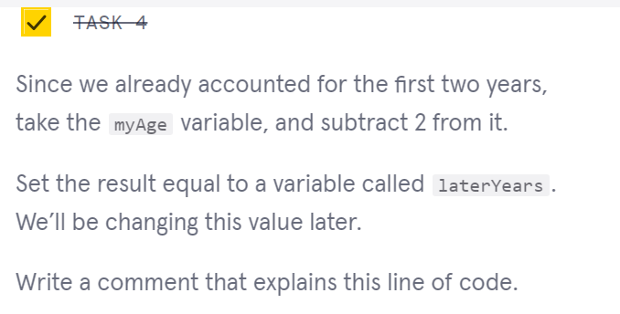

      

 

<a type="button" title="Codecademy_Learn_JavaScript_Course_button" href="https://www.codecademy.com/courses/introduction-to-javascript/projects/dog-years-javascript" target="_blank" data-CodecademyLearnJavascriptCourseButt="CodecademyLearnJavascriptCourseButt_data"></a>

<br><br>

# Dog Years
<br>

# 1. Introduction:


<br>
<br>

# 2. Output:
21 <br>
96 <br>
My name is phuong. I am 26 years old in human years which is 117 years old in dog years
<br>
<br>

# 3. Prompts:


```js
//a variable named 'myAge' that is equal my age as a number
const myAge = 26;
```


```js
//a variable named 'earlyYears' with value 2 that can be used for further changing in value
let earlyYears = 2;
```


```js
earlyYears *= 10.5;
```



```js
//a variable named 'laterYears' that is equal myAge - 2 that can be used for further changing in value
let laterYears = myAge - 2 ;
```


```js
/*
Multiply the laterYears variable by 4 to calculate the number of dog years accounted for by your later years. Use the multiplication assignment operator to multiply and assign in one step.
*/ 
laterYears *= 4 ;
```


```js
console.log(earlyYears);
console.log(laterYears);
```


```js
//Add earlyYears and laterYears together, and store that in a variable named myAgeInDogYears.
let myAgeInDogYears = earlyYears + laterYears;
```


```js
//a variable named 'myName' that stores my name, then use .toLowerCase() method to return my name with all lowercase letters
var myName = 'Phuong'.toLowerCase();
```


```js
//a console.log statement that displays your name and age in dog years. Use string interpolation to display the value
console.log(`My name is ${myName}. I am ${myAge} years old in human years which is ${myAgeInDogYears} years old in dog years`);
```


