      

 

<a type="button" title="Codecademy_Learn_JavaScript_Course_button" href="https://www.codecademy.com/courses/introduction-to-javascript/projects/kelvin-weather-javascript" target="_blank" data-CodecademyLearnJavascriptCourseButt="CodecademyLearnJavascriptCourseButt_data"></a>

<br><br>

# Kelvin Weather

# 1. Introduction:


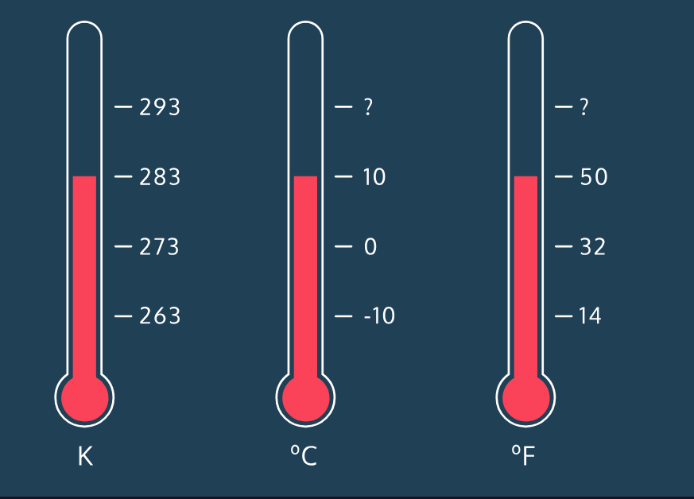


# 2. Output:

# 3. Prompts:
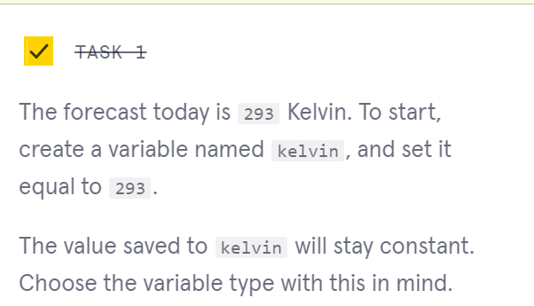
```js
const kelvin = 293;
```

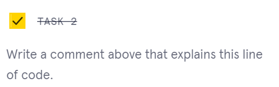
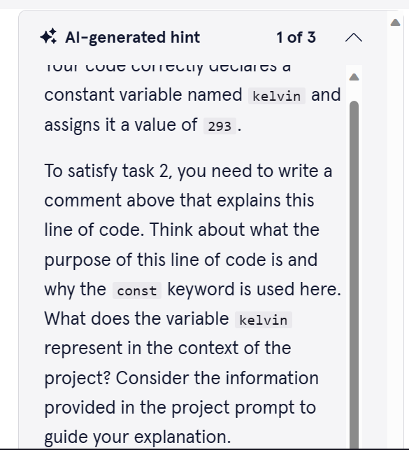


```js
//'const' specifies a constant variable, 'kelvin' is the name of the variable, 293 is the number value of this variable
```

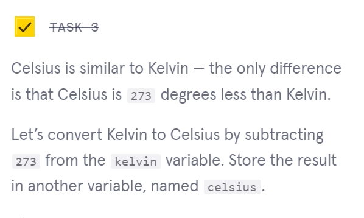
```js
const celsius = kelvin-273;
```

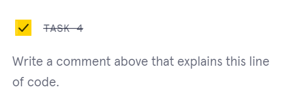

```js
//Celsius is 273 degrees less than, so we are going to create a constant 'celsius' variable and assign it a value by subtracting 273 from the 'kelvin' variable.
```

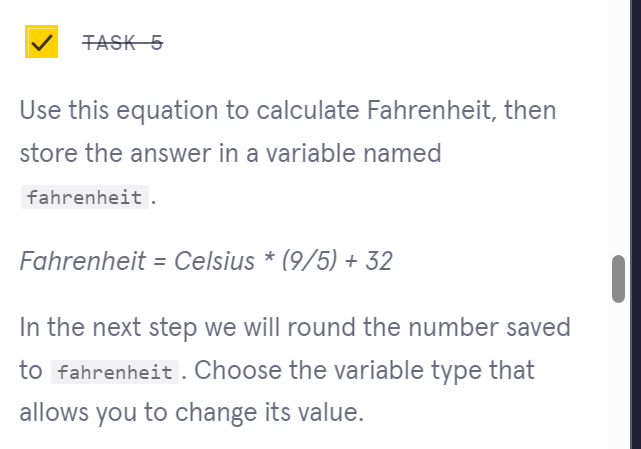

```js
let fahrenheit = celsius*(9/5)+32;
```

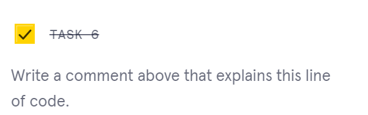

```js
//creates a 'fahrenheit' variable that can be used to assign new value in the further steps. This variable has  the value as celsius*(9/5)+32
```

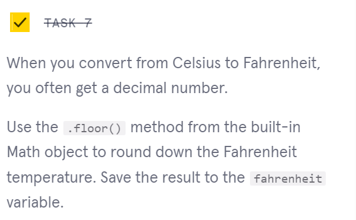

```js
fahrenheit = Math.floor(fahrenheit)
```

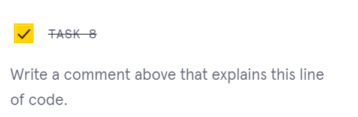
```js
//The syntax below uses the .floor() method from the built-in Math object to round down the Fahrenheit temperature.
```

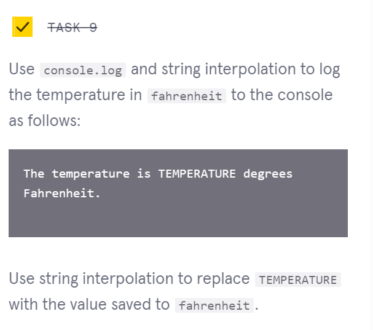
```js
console.log(`The temperature is ${fahrenheit} degrees Fahrenheit.`);
```

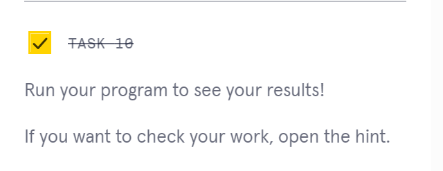

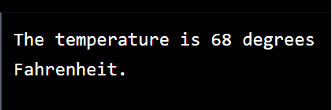

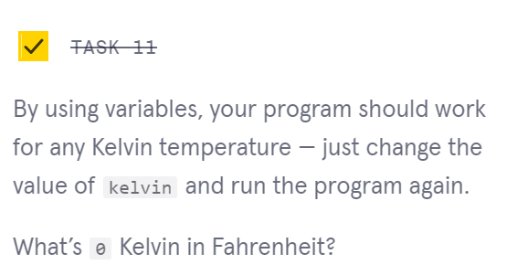
```js
const kelvin = 0;
```

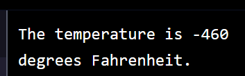


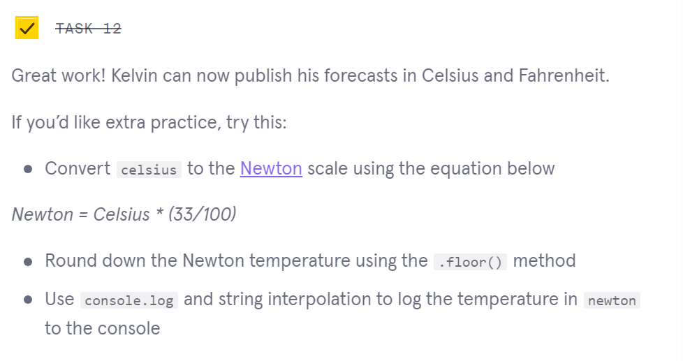