      

 

<a type="button" title="Codecademy_Learn_JavaScript_Course_button" href="https://www.codecademy.com/courses/introduction-to-javascript/projects/magic-eight-ball-1" target="_blank" data-CodecademyLearnJavascriptCourseButt="CodecademyLearnJavascriptCourseButt_data"></a>

<br><br>

# Magic Eight Ball
<br>

# 1. Introduction:
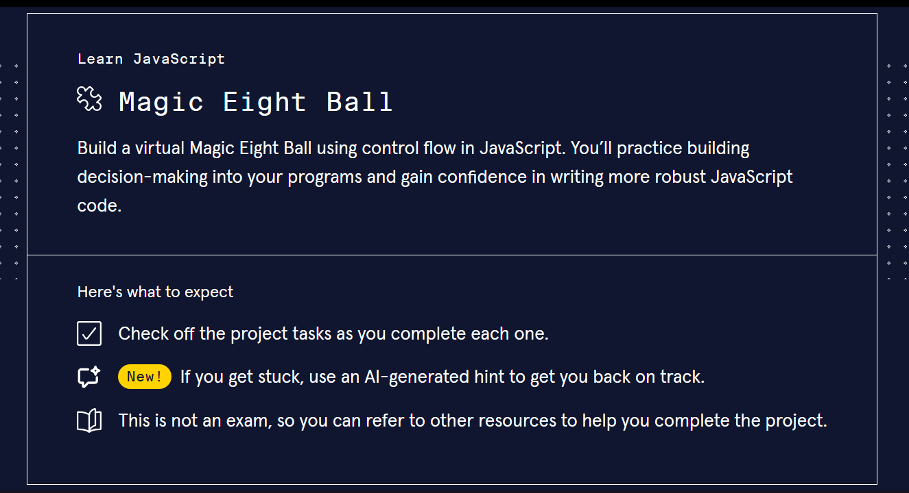

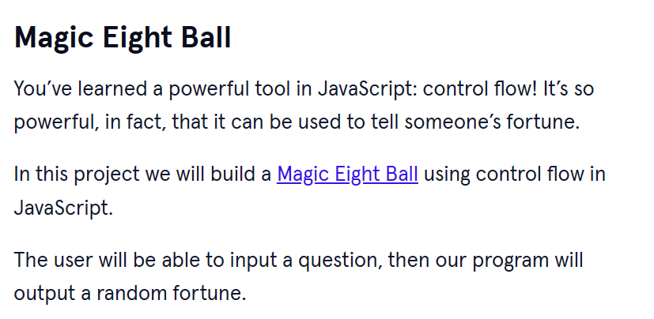
<br>
<br>

# 2. Output:
> Hello. Jane! <br>
> Jane's question: Am I the winner of today's game?<br>
> EightBall's answer: Signs point to yes
<br>
<br>

# 3. Prompts:

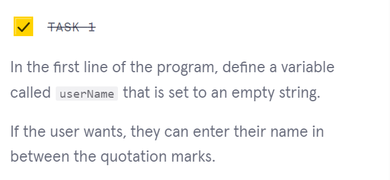

```js
let username = "";
```

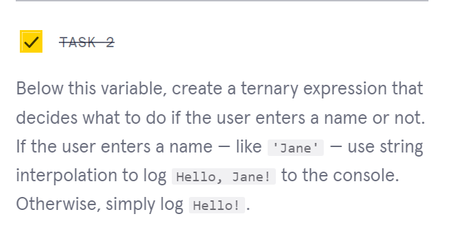
```js
username == "Jane" ? console.log(`Hello. ${username}!`): console.log("Hello!");
```


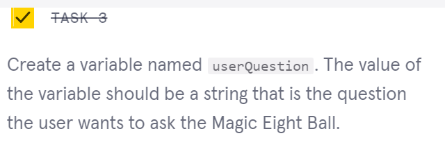
```js
let userQuestion = "Am I the winner of today's game?";
```


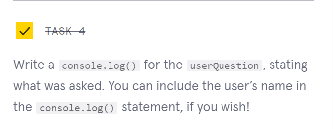
```js
console.log(`${username}'s question: ${userQuestion}`);
```


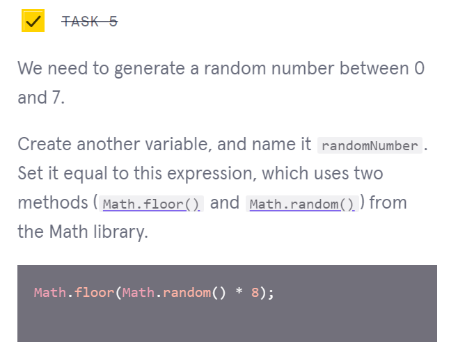
```js
let randomNumber = Math.floor(Math.random() *8);
```


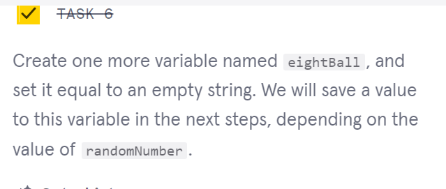
```js
let eightBall = "";
```


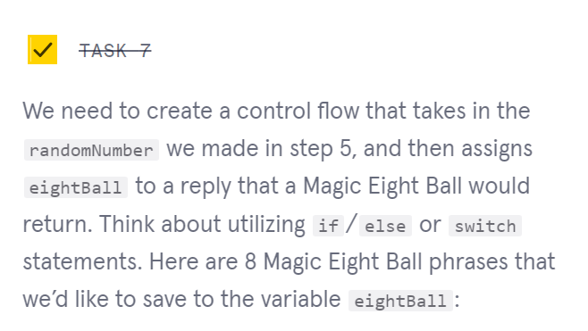
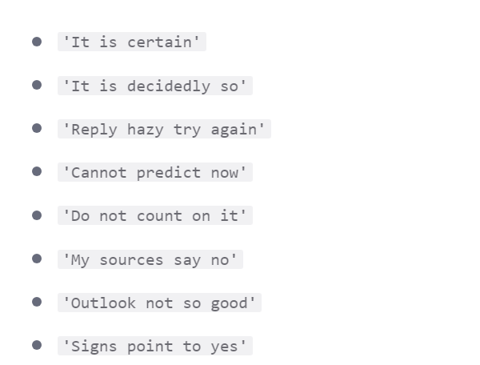
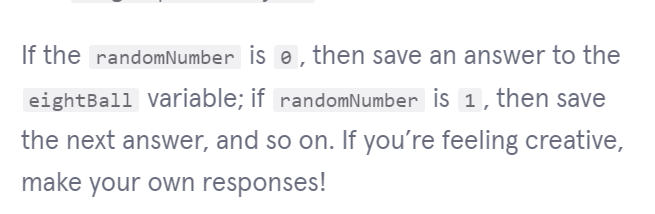
```js
switch(randomNumber){
  case 0:
    eightBall = "It is certain";
    break;
  case 1:
    eightBall = "It is decidedly so";
    break;
  case 2:
    eightBall = "Reply hazy try again";
    break;
  case 3:
    eightBall = "Cannot predict now";
    break;
  case 4:
    eightBall = "Do not count on it";
    break;
  case 5:
    eightBall = "My sources say no";
    break;
  case 6:
    eightBall = "Outlook not so good";
    break;
  case 7:
    eightBall = "Signs point to yes";
    break;
  default:
    eightBall = "";
    break;
}
```


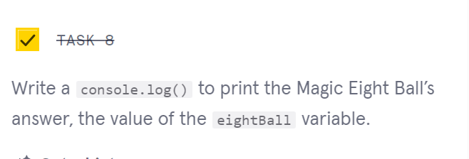
```js
console.log(`EightBall's answer: ${eightBall}`);
```


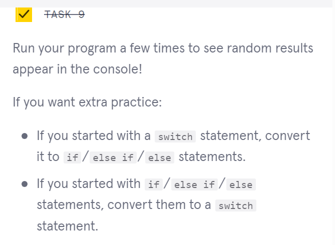