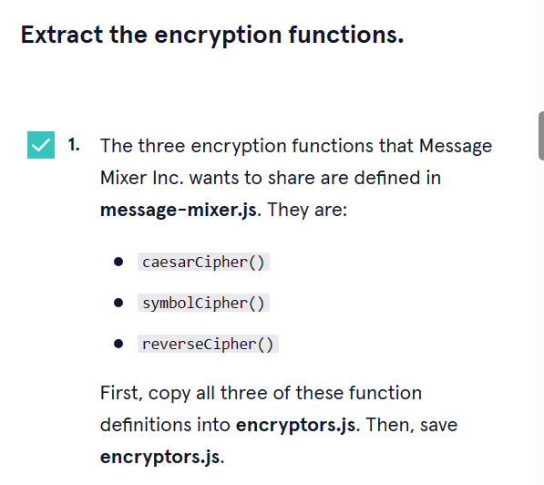

      

 

<a type="button" title="Codecademy_Learn_JavaScript_Course_button" href="https://www.codecademy.com/courses/learn-intermediate-javascript/projects/message-mixer-node" target="_blank" data-CodecademyLearnJavascriptCourseButt="CodecademyLearnJavascriptCourseButt_data"></a>

<br><br>

# Message Mixer
<br>

# 1. Introduction:


<br>
<br>

# 2. Output:

<br>
<br>

# 3. Prompts:



```js
// Declare and export the functions here.

// Encryption Functions
/////////////////////////////////////////////

const caesarCipher = (str, amount = 0) => {
  if (amount < 0) {
    return caesarCipher(str, amount + 26);
  }
  let output = '';
  for (let i = 0; i < str.length; i++) {
    let char = str[i];
    if (char.match(/[a-z]/i)) {
      let code = str.charCodeAt(i);
      if (code >= 65 && code <= 90) {
        char = String.fromCharCode(((code - 65 + amount) % 26) + 65);
      } else if (code >= 97 && code <= 122) {
        char = String.fromCharCode(((code - 97 + amount) % 26) + 97);
      }
    }
    output += char;
  }
  return output;
};

const symbolCipher = (str) => {
  const symbols = {
    'i': '!',
    '!': 'i',
    'l': '1',
    '1': 'l',
    's': '$',
    '$': 's',
    'o': '0',
    '0': 'o',
    'a': '@',
    '@': 'a',
    'e': '3',
    '3': 'e',
    'b': '6',
    '6': 'b'
  }

  let output = '';
  for (let i = 0; i < str.length; i++) {
    let char = str.toLowerCase()[i];

    if (symbols[char]) {
      output += symbols[char]
    } else {
      output += char;
    }
  }
  return output;
}

const reverseCipher = (sentence) => {
  let words = sentence.split(' ');
  for (let i = 0; i < words.length; i++) {
    words[i] = words[i].split('').reverse().join('');
  }
   return words.join(' ');
};
module.exports={
caesarCipher , symbolCipher, reverseCipher
}
```


```js
// Import the functions from encryptors.js here.
const encryptors = require("./encryptors.js");
```

```js
const {caesarCipher,symbolCipher,reverseCipher} = encryptors;

```


```js
const {caesarCipher,symbolCipher,reverseCipher} = require("./encryptors.js");
```


```js
const encodeMessage = (str) => {
  // Use the encryptor functions here.
  let caesar = caesarCipher(str,5);
  let symbol = symbolCipher(caesar);
  return reverseCipher(symbol);
}
```


```js
const decodeMessage = (str) => {
  // Use the encryptor functions here.
   let reverse = reverseCipher(str);
  let symbol = symbolCipher(reverse);
  return caesarCipher(symbol,-5);
}
```
