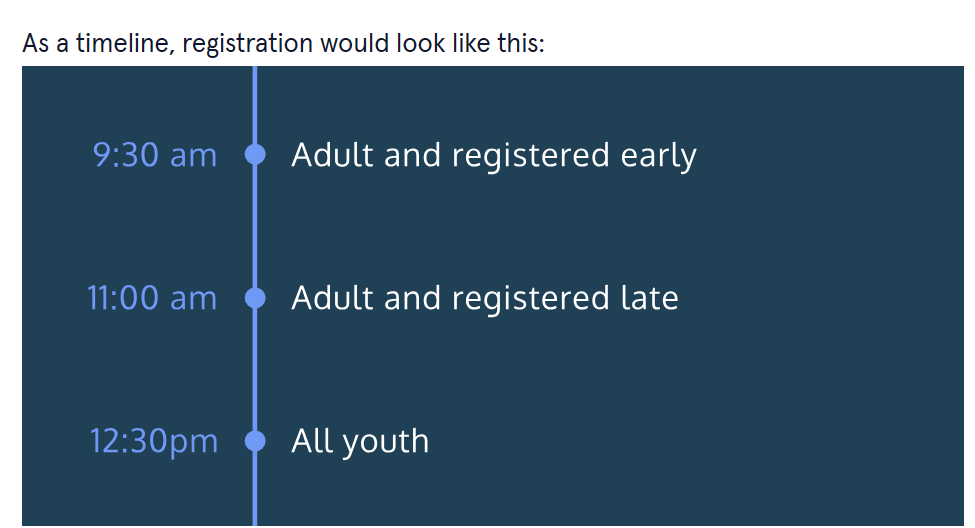

      

 

<a type="button" title="Codecademy_Learn_JavaScript_Course_button" href="https://www.codecademy.com/courses/introduction-to-javascript/projects/race-day" target="_blank" data-CodecademyLearnJavascriptCourseButt="CodecademyLearnJavascriptCourseButt_data"></a>

<br><br>

# Race Day
<br>

# 1. Introduction:





<br>
<br>

# 2. Output:
> You will race at 9:30:AM at race number: 1154
<br>
<br>

# 3. Prompts:


```js
let raceNumber = Math.floor(Math.random() * 1000);
```


```js
let registeredEarly = true;
```


```js
let runnerAge = 26;
```


```js
if(runnerAge >=18 && registeredEarly == true){
  raceNumber+=1000;
}
```


```js
if(runnerAge >18 && registeredEarly == true){
  console.log(`You will race at 9:30:AM at race number: ${raceNumber}`);
}
```


```js
if(runnerAge >18 && registeredEarly == true){
  console.log(`You will race at 9:30:AM at race number: ${raceNumber}`);
}else if(runnerAge >18 && registeredEarly == false){
  console.log(`You will race at 11:00:AM at race number: ${raceNumber}`);
}

```


```js
if(runnerAge < 18){
  console.log(`You will race at 12:30:PM at race number: ${raceNumber}`);
}
```


```js
if(runnerAge >18 && registeredEarly == true){
  console.log(`You will race at 9:30:AM at race number: ${raceNumber}`);
}else if(runnerAge >18 && registeredEarly == false){
  console.log(`You will race at 11:00:AM at race number: ${raceNumber}`);
}else{
  console.log("Please see the registration desk.");
}


if(runnerAge == 18){
  console.log(`Please see the registration desk.`);
}


```


