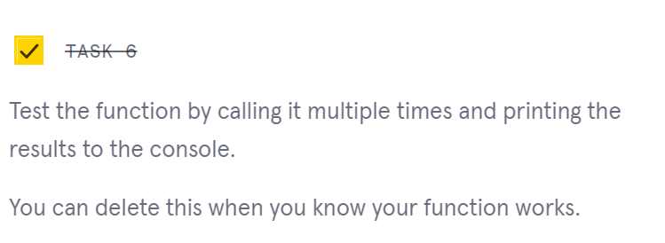
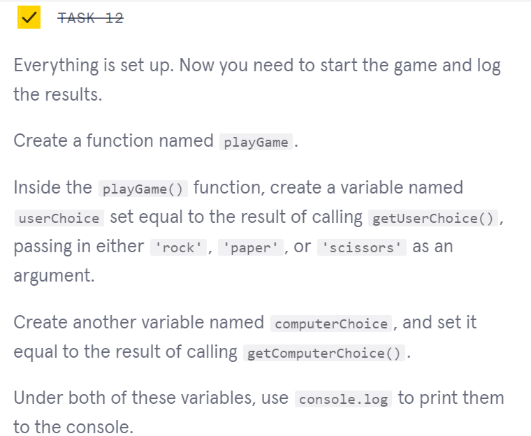

      

 

<a type="button" title="Codecademy_Learn_JavaScript_Course_button" href="https://www.codecademy.com/courses/introduction-to-javascript/projects/rock-paper-scissors-javascript" target="_blank" data-CodecademyLearnJavascriptCourseButt="CodecademyLearnJavascriptCourseButt_data"></a>

<br><br>

# Rock Paper Scissors
<br>

# 1. Introduction:


<br>
<br>

# 2. Output:
> bomb <br>
> paper <br>
> The user won!!! <br>
> The output will change every time you run the program to determine the winner. <br>
<br>
<br>

# 3. Prompts:


```js
const getUserChoice = userInput =>{
  userInput=userInput.toLowerCase();

}
```


```js
const getUserChoice = userInput =>{
  userInput=userInput.toLowerCase();

  if(userInput == 'rock' || userInput == 'paper' || userInput == 'scissors'){
    return userInput;
  }else{
    console.log("You must choice 'rock', 'paper', or 'scissors'!!!");
  }
}
```


```js
console.log(getUserChoice('paper'));
//Output: paper
```


```js
const getComputerChoice = () => {
  let num = Math.floor(Math.random() *3);
  switch(num){
    case 0:
      return 'rock';
      break;
    case 1:
      return 'paper';
      break;
    case 2:
      return 'scissors';
      break;
    default:
      return '';
      break;
  }
}
```


```js
console.log(getComputerChoice());
```


```js
const determineWinner = (userChoice, computerChoice) => {
  if(userChoice == computerChoice){
    return "The game was a tie";
  }
}
```


```js
const determineWinner = (userChoice, computerChoice) => {
  if(userChoice == computerChoice){
    return "The game was a tie";
  }

  if(userChoice == 'rock'){
    if(computerChoice == 'paper'){
      return 'The computer won!!!';
    }else{
      return 'The user won!!!';
    }
  }

}
```


```js
if(userChoice == 'paper'){

    if(computerChoice == 'scissors'){
      return 'The computer won!!!';
    }

    if(computerChoice == 'rock'){
      return 'The user won!!!';
    }


}
```


```js
 if(userChoice == 'scissors'){

    if(computerChoice == 'rock'){
      return 'The computer won!!!';
    }

    if(computerChoice == 'paper'){
      return 'The user won!!!';
    }

  }
```


```js
console.log(determineWinner('paper','scissors'));
//The computer won!!!
console.log(determineWinner('paper','rock'));
//The user won!!!
console.log(determineWinner('paper','paper'));
//The game was a tie
console.log(determineWinner('rock','paper'));
//The computer won!!!
console.log(determineWinner('rock','scissors'));
//The user won!!!
console.log(determineWinner('rock','rock'));
//The game was a tie
console.log(determineWinner('scissors','rock'));
//The computer won!!!
console.log(determineWinner('scissors','paper'));
//The user won!!!
console.log(determineWinner('scissors','scissors'));
//The game was a tie

```


```js
let playGame = () => {
  let userChoice = getUserChoice('rock');

  let computerChoice = getComputerChoice();

  console.log(userChoice);
  console.log(computerChoice);
}
```


```js
let playGame = () => {
  let userChoice = getUserChoice('rock');

  let computerChoice = getComputerChoice();

  console.log(userChoice);
  console.log(computerChoice);

  console.log(determineWinner(userChoice,computerChoice));
}

playGame();

```


```js
//Add userInput == 'bomb' to getUserChoice()
const getUserChoice = userInput =>{
  userInput=userInput.toLowerCase();

  if(userInput == 'rock' || userInput == 'paper' || userInput == 'scissors' || userInput == 'bomb'){
    return userInput;
  }else{
    console.log("You must choice 'rock', 'paper', or 'scissors'!!!");
  }
}

//Add userChoice == 'bomb' to determineWinner()

const determineWinner = (userChoice, computerChoice) => {

  if(userChoice == computerChoice){
    return "The game was a tie";
  }

  if(userChoice == 'bomb'){
    return "The user won!!!";
  }

  if(userChoice == 'rock'){
    if(computerChoice == 'paper'){
      return 'The computer won!!!';
    }else{
      return 'The user won!!!';
    }
  }

  if(userChoice == 'paper'){

    if(computerChoice == 'scissors'){
      return 'The computer won!!!';
    }

    if(computerChoice == 'rock'){
      return 'The user won!!!';
    }


  }


  if(userChoice == 'scissors'){

    if(computerChoice == 'rock'){
      return 'The computer won!!!';
    }

    if(computerChoice == 'paper'){
      return 'The user won!!!';
    }

  }


}
```

