      

 

<a type="button" title="Codecademy_Learn_JavaScript_Course_button" href="https://www.codecademy.com/courses/introduction-to-javascript/projects/sleep-debt-calculator" target="_blank" data-CodecademyLearnJavascriptCourseButt="CodecademyLearnJavascriptCourseButt_data"></a>

<br><br>

# Sleep Debt Calculator
<br>

# 1. Introduction:
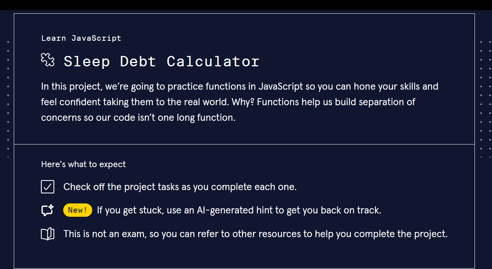

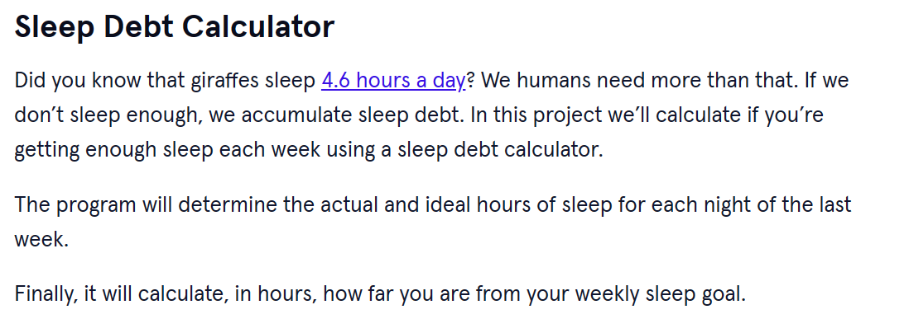
<br>
<br>

# 2. Output:
> 7 <br>
> 50 <br>
> 49 <br>
> The user got more sleep than needed. <br>

<br>
<br>

# 3. Prompts:

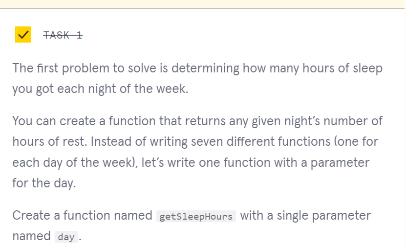
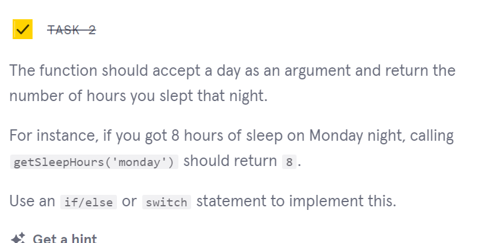
```js
let getSleepHours = day => {
  switch(day){
    case 'monday':
      return 7;
      break;
    case 'tuesday':
      return 8;
      break;
    case 'wednesday':
      return 6;
      break;
    case 'thursday':
      return 7;
      break;
    case 'friday':
      return 6;
      break;
    case 'saturday':
      return 8;
      break;
    case 'sunday':
      return 8;
      break;
    default:
      return 0;
      break;
  }
}
```

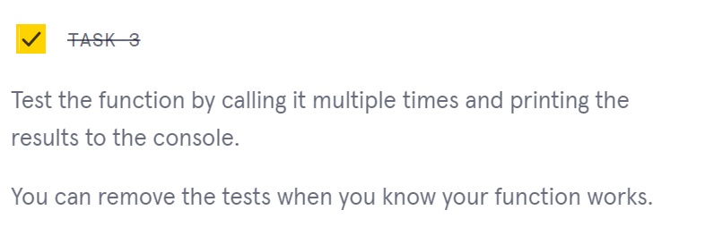
```js
console.log(getSleepHours('monday'));//7
```

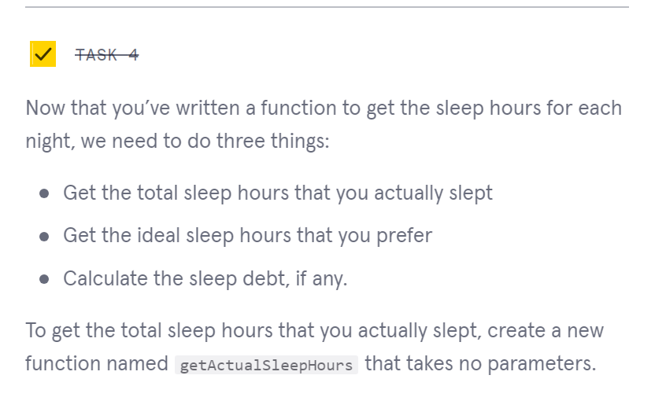
```js
let getActualSleepHours = () => {
  
}
```

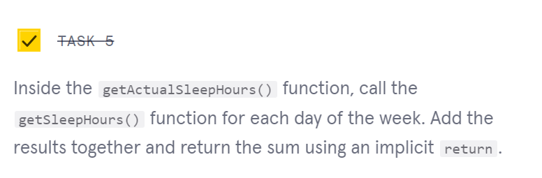
```js
let getActualSleepHours = () => {
  let totalSleepHours = getSleepHours('monday')+
  getSleepHours('tuesday')+
  getSleepHours('wednesday')+
  getSleepHours('thursday')+
  getSleepHours('friday')+
  getSleepHours('saturday')+
  getSleepHours('sunday');

  return totalSleepHours;
}
```

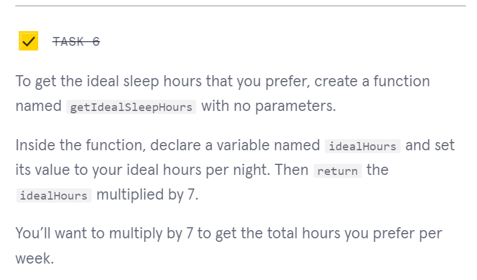
```js
let getIdealSleepHours = () => {
  let idealHours = 7;
  return idealHours*7;
}
```

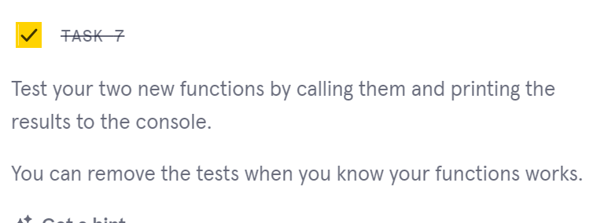
```js
console.log(getActualSleepHours());
//50
console.log(getIdealSleepHours());
//49
```

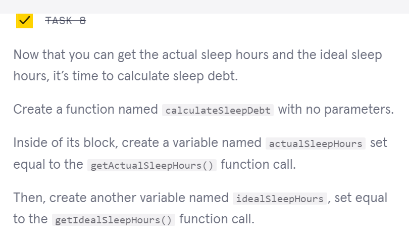
```js
let calculateSleepDebt = () => {
  let actualSleepHours = getActualSleepHours();

  let idealSleepHours = getIdealSleepHours();
}
```

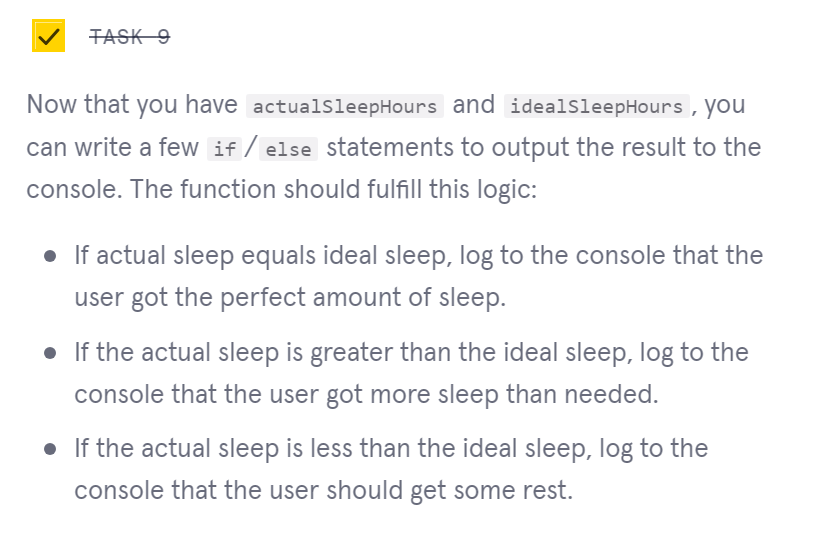
```js
let calculateSleepDebt = () => {
  let actualSleepHours = getActualSleepHours();

  let idealSleepHours = getIdealSleepHours();

  if(actualSleepHours == idealSleepHours){
    return "The user got the perfect amount of sleep";
  }else if(actualSleepHours > idealSleepHours){
    return "The user got more sleep than needed.";
  }else if(actualSleepHours < idealSleepHours){
    return "The user should get some rest.";
  }else{
    return "";
  }
}

```

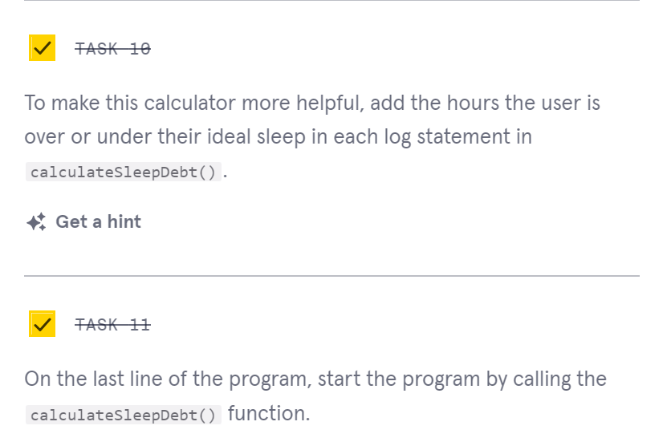
```js
console.log(calculateSleepDebt());
```

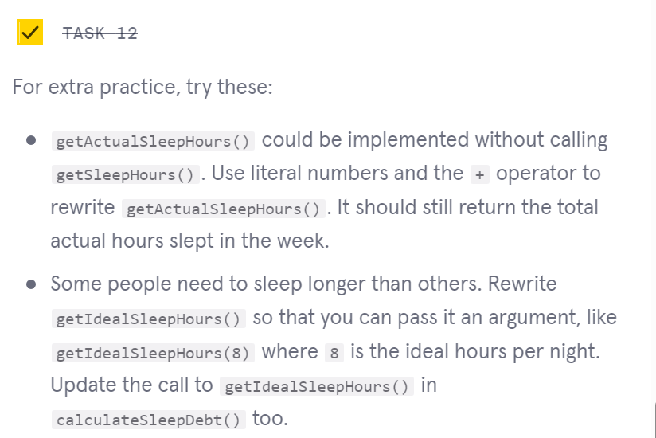

