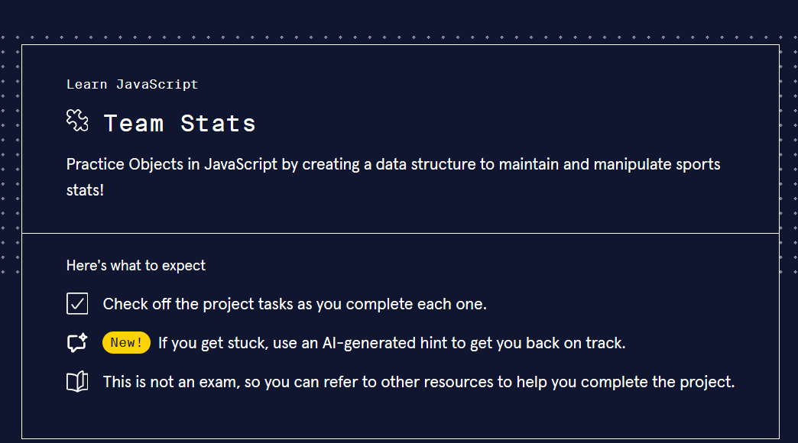
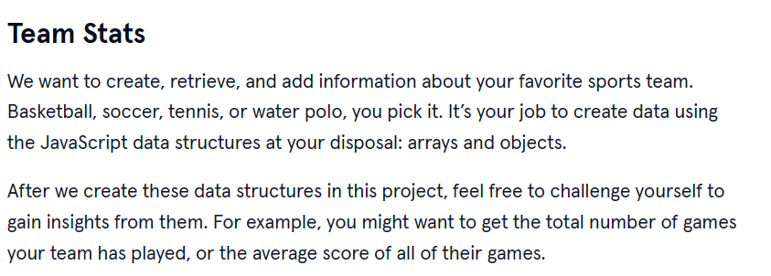
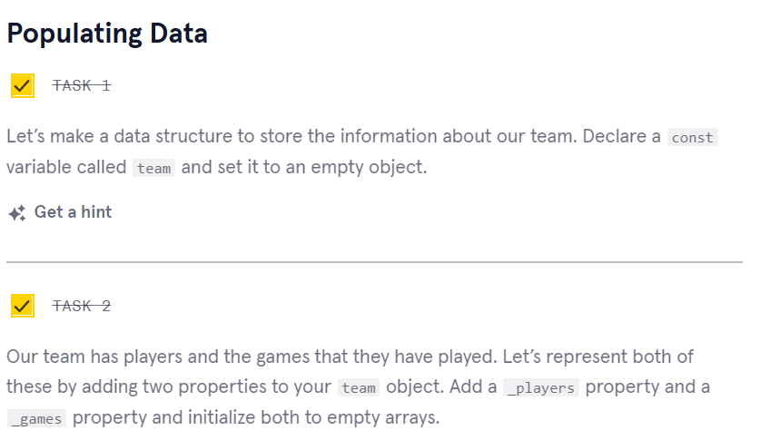
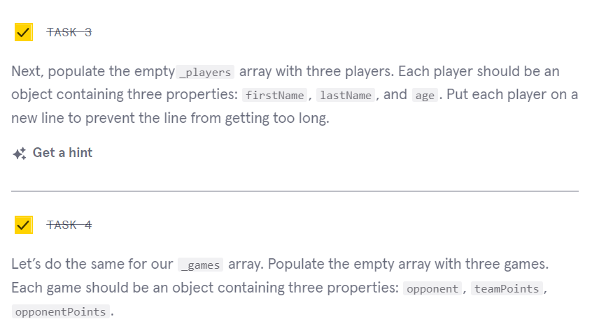
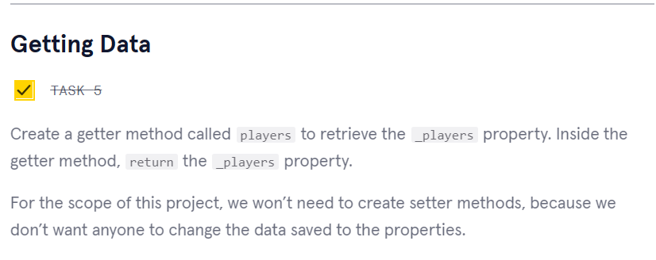
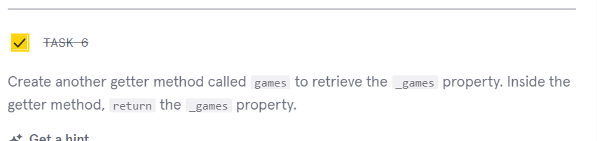
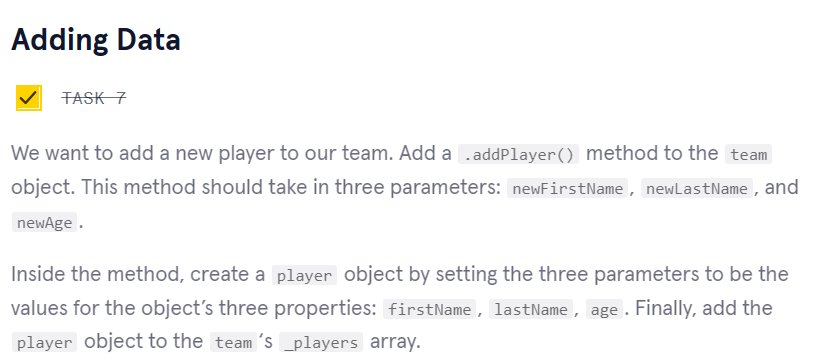
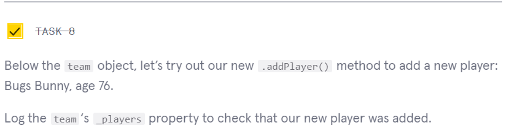
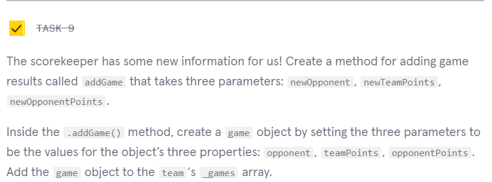
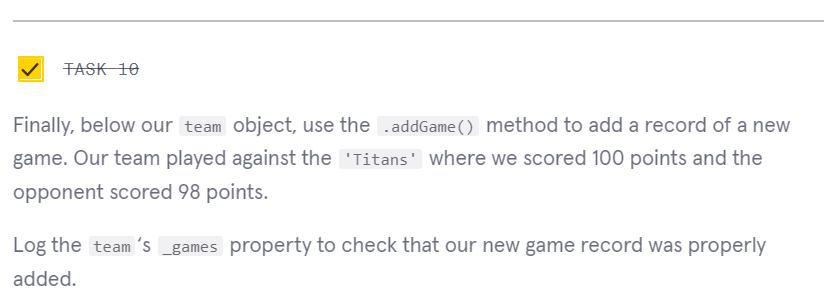

      

 

<a type="button" title="Codecademy_Learn_JavaScript_Course_button" href="https://www.codecademy.com/courses/introduction-to-javascript/projects/team-stats" target="_blank" data-CodecademyLearnJavascriptCourseButt="CodecademyLearnJavascriptCourseButt_data"></a>

<br><br>

# Team Stats
<br>

# 1. Introduction:


<br>
<br>

# 2. Output:
> [ <br>
>   { firstName: 'John', lastName: 'Carter', age: 26 }, <br>
>   { firstName: 'Jack', lastName: 'Doe', age: 30 }, <br>
>   { firstName: 'Jane', lastName: 'Smith', age: 28 }, <br>
>   { firstName: 'Bugs', lastName: 'Bunny', age: 76 } <br>
> ] <br>
> [ <br>
>   { opponent: 'Hi-Tech', teamPoints: 86,  opponentPoints: 92 },<br>
>   { opponent: 'Unicorn', teamPoints: 65,  opponentPoints: 49 },<br>
>   { opponent: 'Sky Knights', teamPoints: 97,  opponentPoints: 66 },<br>
>   { opponent: 'Titan', teamPoints: 100, opponentPoints:  98 }<br>
> ] <br>
<br>
<br>

# 3. Prompts:


```js
const team = {
  _players:[],
  _games:[]
};
```


```js
const team = {
  _players:[
    {
      firstName:"John",
      lastName:"Carter",
      age:26,
    },
    {
      firstName:"Jack",
      lastName:"Doe",
      age:30,
    },
    {
      firstName:"Jane",
      lastName:"Smith",
      age:28,
    }
  ],
  _games:[
    {
      opponent:"Hi-Tech",
      teamPoints:86,
      opponentPoints:92,
    },
     {
      opponent:"Unicorn",
      teamPoints:65,
      opponentPoints:49,
    },
     {
      opponent:"Sky Knights",
      teamPoints:97,
      opponentPoints:66,
    }
  ],
};
```



```js
get players(){
    return this._players;
},
get games(){
    return this._games;
}
```


```js
addPlayer(newFirstName, newLastName, newAge){
    let player = {
      firstName: newFirstName,
      lastName: newLastName,
      age: newAge
    }
    this._players.push(player);
  }
```


```js
team.addPlayer("Bugs","Bunny",76);
console.log(team._players);
/*
[
  { firstName: 'John', lastName: 'Carter', age: 26 },
  { firstName: 'Jack', lastName: 'Doe', age: 30 },
  { firstName: 'Jane', lastName: 'Smith', age: 28 },
  { firstName: 'Bugs', lastName: 'Bunny', age: 76 }
]
*/
```


```js
addGame(newOpponent, newTeamPoints, newOpponentPoints){
    let game = {
      opponent:newOpponent,
      teamPoints:newTeamPoints,
      opponentPoints:newOpponentPoints
    }
    this._games.push(game);
}
```


```js
team.addGame("Titan",100,98);
console.log(team._games);
/*
[
  { opponent: 'Hi-Tech', teamPoints: 86, opponentPoints: 92 },
  { opponent: 'Unicorn', teamPoints: 65, opponentPoints: 49 },
  { opponent: 'Sky Knights', teamPoints: 97, opponentPoints: 66 },
  { opponent: 'Titan', teamPoints: 100, opponentPoints: 98 }
]
*/
```


