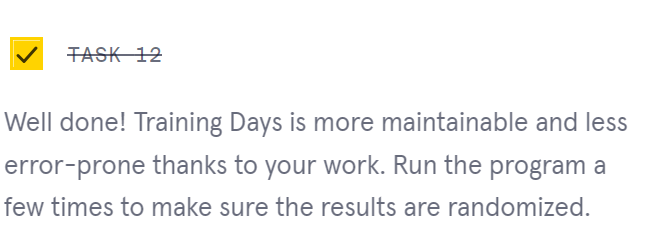

      

 

<a type="button" title="Codecademy_Learn_JavaScript_Course_button" href="https://www.codecademy.com/courses/introduction-to-javascript/projects/training-days" target="_blank" data-CodecademyLearnJavascriptCourseButt="CodecademyLearnJavascriptCourseButt_data"></a>

<br><br>

# Training Days
<br>

# 1. Introduction:


<br>
<br>

# 2. Output:
> Nala's event is: Triathlon <br>
> Nala's time to train is: undefined days <br>
> Warren's event is: Marathon <br>
> Warren's time to train is: undefined days <br>

<br>
<br>

# 3. Prompts:


```js
const getTrainingDays = event => {
   let days ;
  if (event === 'Marathon') {
    
  } else if (event === 'Triathlon') {
   
  } else if (event === 'Pentathlon') {
   
  }

  return days;
};
```


```js
const logEvent = (name,event) => {
  
  console.log(`${name}'s event is: ${event}`);
};

const logTime = (name,days) => {
  
  console.log(`${name}'s time to train is: ${days} days`);
};

```


```js
const name = 'Nala';
const logEvent = (name,event) => {
  
  console.log(`${name}'s event is: ${event}`);
};

const logTime = (name,days) => {
  
  console.log(`${name}'s time to train is: ${days} days`);
};

logEvent(name,event);
logTime(name,days);
```


```js
const getRandEvent = () => {
  const random = Math.floor(Math.random() * 3);
  if (random === 0) {
    return 'Marathon';
  } else if (random === 1) {
    return 'Triathlon';
  } else if (random === 2) {
    return 'Pentathlon';
  }
};
```

