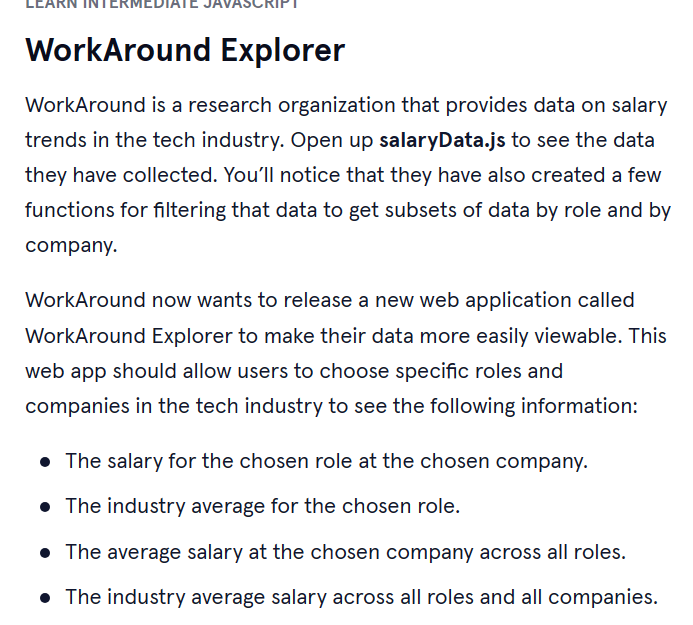

      

 

<a type="button" title="Codecademy_Learn_JavaScript_Course_button" href="https://www.codecademy.com/courses/learn-intermediate-javascript/projects/es6-modules-workaround" target="_blank" data-CodecademyLearnJavascriptCourseButt="CodecademyLearnJavascriptCourseButt_data"></a>

<br><br>

# WorkAround Explorer
<br>

# 1. Introduction:



<br>
<br>

# 2. Output:


> ## Data will change according to the selection of the user based on role and company.

<br>
<br>

# 3. Prompts:

```js
export {getRoles,getCompanies,getDataByRole,getDataByCompany,salaryData as default};
```


```js
import {getRoles,getCompanies} from "./modules/salaryData.js";
```


```js
const companies = getCompanies();
const roles = getRoles();
```

```js
 <script type="module" src="main.js" defer></script>
```


```js
import {getDataByRole,getDataByCompany} from "./salaryData.js";
import salaryData from "./salaryData.js";

```


```js
// Add your imports here.
import {getDataByRole,getDataByCompany} from "./salaryData.js";
import salaryData from "./salaryData.js";

// Replace the empty array with the appropriate imported function/value
const getAverageSalaryByRole = role => {
  const roleData = getDataByRole(role);
  const salariesOfRole = roleData.map(obj => obj.salary);
  return calculateAverage(salariesOfRole);
}

// Replace the empty array with the appropriate imported function/value
const getAverageSalaryByCompany = company => {
  const companyData = getDataByCompany(company);
  const salariesAtCompany = companyData.map(obj => obj.salary);
  return calculateAverage(salariesAtCompany);
}

// Replace the empty array with the appropriate imported function/value
const getSalaryAtCompany = (role, company) => {
  const companyData = getDataByCompany(company);
  const roleAtCompany = companyData.find(obj => obj.role === role);
  return roleAtCompany.salary;
}

// Replace the empty array with the appropriate imported function/value
const getIndustryAverageSalary = () => {
  const allSalaries = salaryData.map(obj => obj.salary);
  return calculateAverage(allSalaries);
}


// Helper Function. Do not edit.
// Note: This function does not need to be exported since it is only used by the functions contained within this module.
function calculateAverage(arrayOfNumbers) {
  let total = 0;
  arrayOfNumbers.forEach(number => total += number);
  return (total / arrayOfNumbers.length).toFixed(2);
}

export {getAverageSalaryByRole,getAverageSalaryByCompany,getSalaryAtCompany,getIndustryAverageSalary}

```


```js
import {getAverageSalaryByRole,getAverageSalaryByCompany,getSalaryAtCompany,getIndustryAverageSalary} from "./modules/workAroundModule.js";

```


